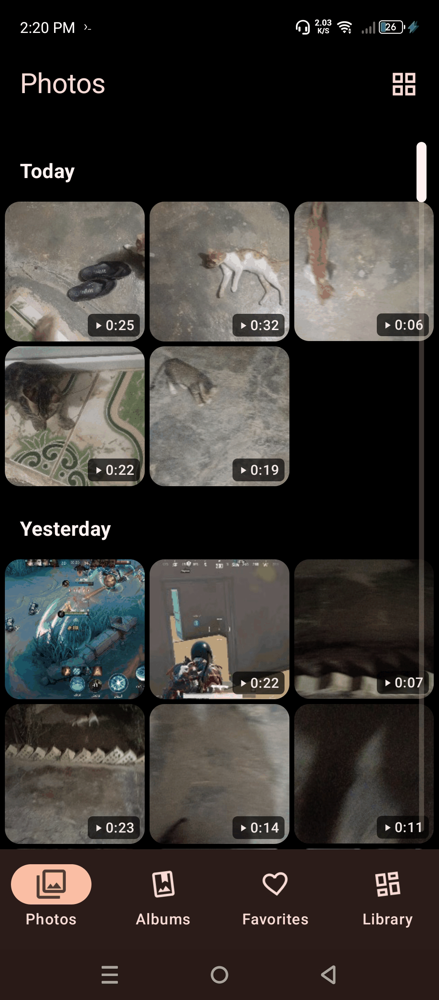
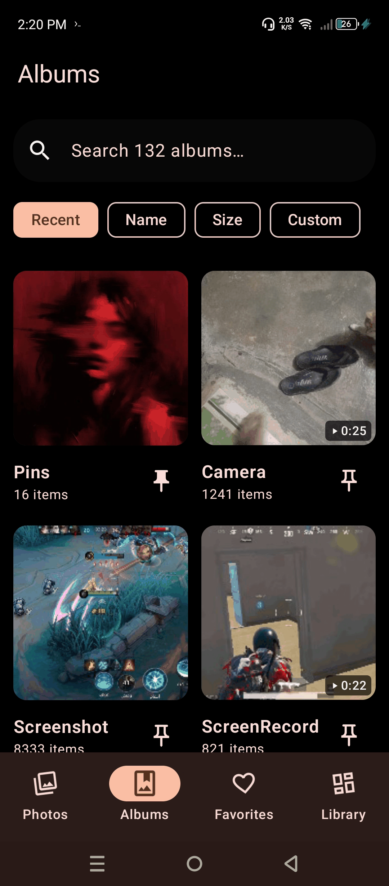
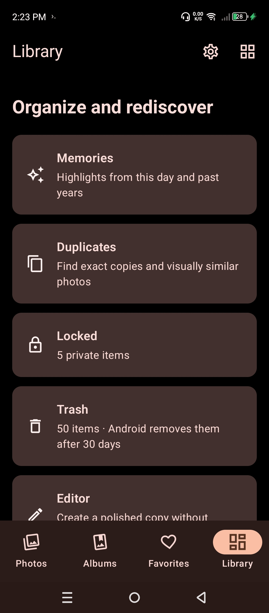
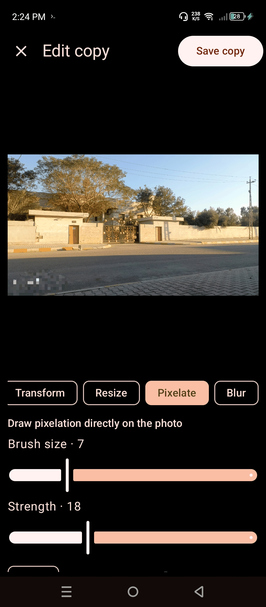
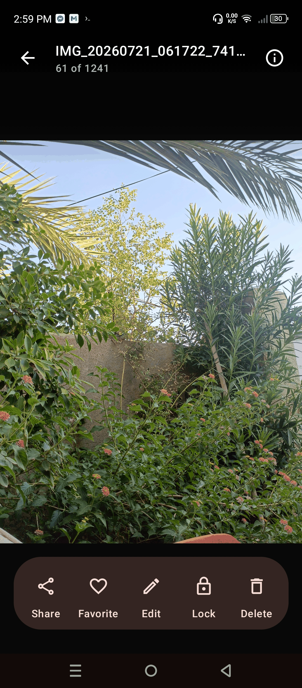

> [!CAUTION]
> This is a fork of https://github.com/MohamadOday/iris-gallery<br>
> The original project is licensed under **Apache License, Version 2.0**<br>
> This fork/project (The combined work and all modifications) is licensed under **GNU General Public License Version 3 (GPLv3)**

<p align="center">
  
</p>

<h1 align="center">Iris Gallery</h1>

<p align="center">
  A fast, private, 100% offline gallery app for Android built with Jetpack Compose and Material 3.
</p>

<p align="center">
  <a href="https://github.com/AndroidSuggest/iris-branch-a/releases/latest"></a>
  
  
  <a href="LICENSE"></a>
</p>

---

<p align="center">
  
  
  
  
  
</p>

Iris Gallery is designed to be a private, responsive, and customizable local media viewer. It has zero network permissions, opens instantly, and stays out of your way.

> [!IMPORTANT]
> ## Current differences to original Iris Gallery
>
>- Corrected scrollbubble calculation, exact date flip and simplified date display detection
>- Sticky header during scrolling
>- Bigger video gesture area (50% instead of 16%) and video volume changes relative to the system volume instead of direct controlling the device volume. >(Following common built-in videoplayer standards)
>- Semi-transparent photo/video detail-sheet
>- Improved external editior functionality
>- XPTags and DocumentName parser

---

## Download & Installation

### GitHub Releases
Download the signed APK directly from the [Releases](https://github.com/AndroidSuggest/iris-branch-a/releases/latest) page.

---

## Highlights

- **100% Offline & Private**: Zero `INTERNET` permission in the manifest. Photos, videos, and metadata never leave your device.
- **Live Media Sync**: Automatic real-time timeline detection for new camera photos and downloads without needing app restarts.
- **Fluid Grid & Pinch Resize**: Smoothly resize the photos grid (2–6 columns) and albums grid (1–4 columns) with responsive pinch gestures.
- **Built-in Photo Editor**: Crop with aspect presets, rotate, flip, adjustments (Brightness, Contrast, Saturation, Warmth), freehand blur/pixelate brushes, resize, and external editor integration (Snapseed, Lightroom, ImageToolbox).
- **High-Res Viewer & EXIF/GPS Inspector**: Hardware canvas rendering with multi-level zoom (up to 7×), detailed camera metadata (ISO, aperture, shutter speed, focal length), and one-tap map location launcher.
- **Media3 Video Player**: Powered by ExoPlayer with sensor-aware hardware rotation, gesture seeking, auto-play, and mute controls.
- **App Lock & Private Vault**: Protect the entire app or media picker with a custom PIN and biometric fingerprint unlock, plus a dedicated encrypted vault for sensitive media.
- **Safe 30-Day Trash**: Move deleted items to the trash with easy restoration or one-tap permanent purge.
- **Album Management**: Create custom albums, move/copy media between folders, customize album covers, pin favorites, and sort by name, date, or count.
- **Duplicate & Similar Photo Finder**: Scan and clean up redundant media to reclaim device storage.
- **Smart Media Categorization**: Dedicated filters for RAW photos, animated GIFs, Motion Photos, Panoramas, and Screenshots.
- **Home Screen Photo Widget**: Customizable home screen widget with automatic memory rotation.
- **Multilingual Support**: Fully localized in 13+ languages with in-app language switcher.
- **Deep Customization**: Material You dynamic theming, pure AMOLED dark mode, adjustable corner rounding, startup tab selection, and thumbnail grid density sliders.

## Privacy

Iris Gallery does not include any analytics, crash reporters, telemetry, or network-enabled libraries. The app cannot make network requests at runtime because network permissions are completely omitted from `AndroidManifest.xml`.

## License

This project is a fork of the original work by Mohamad Oday, which is licensed under the Apache License, Version 2.0. 
The combined work and all modifications in this fork are distributed under the **GNU General Public License Version 3 (GPLv3)**.

---

### Original License Notice (Apache 2.0)
```
Copyright 2026 Mohamad Oday

Licensed under the Apache License, Version 2.0 (the "License");
you may not use this file except in compliance with the License.
You may obtain a copy of the License at

    http://www.apache.org/licenses/LICENSE-2.0

Unless required by applicable law or agreed to in writing, software
distributed under the License is distributed on an "AS IS" BASIS,
WITHOUT WARRANTIES OR CONDITIONS OF ANY KIND, either express or implied.
See the License for the specific language governing permissions and
limitations under the License.
```
